# Adaptive Optimization Algorithms from Scratch

**First-order and quasi-Newton optimization algorithms implemented from scratch in NumPy** —
no PyTorch, no TensorFlow, no autograd. A clean, tested, documented optimization library
with benchmark-function visualizations, real classification experiments, and an interactive
Streamlit dashboard.

<p align="left">
  
  
  
  
</p>

> **Repository:** https://github.com/Denxhinjo/adaptive-optimization
> **Project page:** https://denxhinjo.github.io/adaptive-optimization/ (static, GitHub Pages)

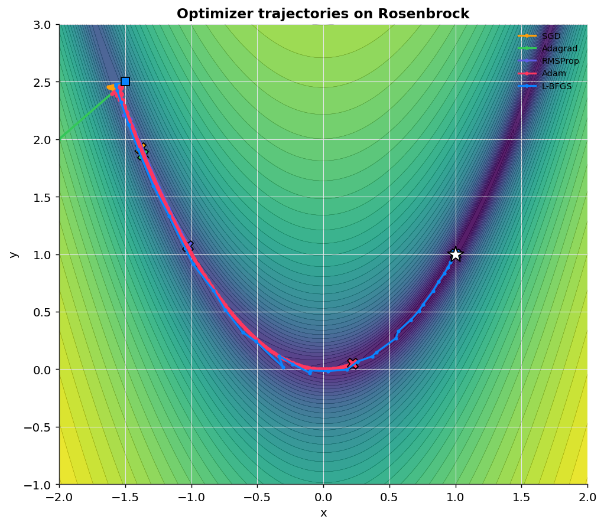

---

## Table of Contents

- [Overview](#overview)
- [Key Features](#key-features)
- [Architecture](#architecture)
- [Project Structure](#project-structure)
- [Installation](#installation)
- [Quickstart](#quickstart)
- [Mathematical Background](#mathematical-background)
  - [Gradient Descent](#gradient-descent)
  - [Stochastic Gradient Descent](#stochastic-gradient-descent-sgd)
  - [Adagrad](#adagrad)
  - [AdaGrad-Norm](#adagrad-norm)
  - [RMSProp](#rmsprop)
  - [Adam](#adam)
  - [L-BFGS](#l-bfgs)
  - [Models: Logistic & Softmax Regression](#models-logistic--softmax-regression)
- [Benchmark Functions](#benchmark-functions)
- [Experimental Setup](#experimental-setup)
- [Results](#results)
  - [a9a — Binary Classification](#a9a--binary-classification)
  - [MNIST — Multi-Class Classification](#mnist--multi-class-classification)
- [Testing](#testing)
- [Future Improvements](#future-improvements)
- [References](#references)
- [License](#license)

---

## Overview

This project is a from-scratch implementation of the optimization algorithms that power
modern machine learning, built to demonstrate optimization theory, numerical computing,
and software engineering practice together in one library:

- **7 optimizers** implemented in pure NumPy behind one shared interface
- **2 classification models** (logistic regression, softmax regression) trained by any of them
- **4 non-convex benchmark functions** with animated trajectory visualizations
- **2 real datasets** (a9a, MNIST) plus fast synthetic generators for instant demos
- **9 comparison metrics** auto-tabulated across optimizers (loss, accuracy, gradient norm,
  convergence speed, runtime, memory, stability, ...)
- **An interactive Streamlit dashboard** to train, race, and compare optimizers live
- **65 unit/integration tests** (gradient checks via finite differences, convergence checks,
  visualization smoke tests)

## Key Features

- **Zero deep-learning-framework dependencies for the math.** Every optimizer update rule,
  every loss function, and every gradient is hand-derived and implemented in NumPy —
  `scipy` is used only as an L-BFGS *baseline reference* and for sparse matrix support.
- **One consistent `Optimizer` interface.** `step(params, grad) -> new_params`, so any
  optimizer works on a logistic-regression weight vector, a softmax weight *matrix*, or a
  2-D benchmark-function point without special-casing.
- **Gradient-checked.** Every model and benchmark-function gradient is verified against
  central finite differences in the test suite.
- **Real, auto-generated results.** Every figure and table under [`assets/`](assets/) is
  produced by [`experiments/generate_results.py`](experiments/generate_results.py) — not
  hand-crafted — so re-running it regenerates the entire README's evidence base.

## Architecture

```
                       ┌───────────────┐
                       │  optimizers/  │  Optimizer.step(params, grad) -> new_params
                       │  (7 classes)  │  GD · SGD · Adagrad · AdaGrad-Norm · RMSProp · Adam · L-BFGS
                       └───────┬───────┘
                               │ used by
             ┌─────────────────┼─────────────────┐
             ▼                                    ▼
     ┌───────────────┐                   ┌──────────────────┐
     │    models/     │  loss/grad(w,X,y) │   benchmarks/     │  f(x,y), grad(point)
     │ Logistic · Softmax │◄──────────────┤ Rosenbrock · Himmelblau │
     └───────┬───────┘                   │ Beale · Rastrigin  │
             │                            └─────────┬─────────┘
             ▼                                       ▼
     ┌────────────────────────────────────────────────────────┐
     │                     experiments/                        │
     │  Trainer · compare_optimizers · benchmark_runner         │
     │  (epochs, batches, metrics, timing, memory)               │
     └───────────────────────┬──────────────────────────────────┘
                              ▼
             ┌────────────────────────────────┐
             │          visualization/          │  loss/acc curves, contour + trajectory,
             │      plots.py · trajectory.py    │  confusion matrix, animated GIFs
             └────────────────┬─────────────────┘
                               ▼
            ┌───────────────────────────────────┐
            │   streamlit_app/  (interactive)     │   notebooks/ (narrative walkthroughs)
            └───────────────────────────────────┘
```

## Project Structure

```
adaptive-optimization/
├── optimizers/            # base.py + one file per optimizer (math in each docstring)
├── models/                 # BaseModel, LogisticRegression, SoftmaxRegression
├── benchmarks/             # Rosenbrock, Himmelblau, Beale, Rastrigin (+ analytic grads)
├── datasets/                # a9a / MNIST loaders (+ synthetic generators), raw/ cache
├── utils/                   # logging config, metrics (accuracy, runtime, memory, grad norm)
├── experiments/             # Trainer, compare_optimizers, benchmark_runner, generate_results
├── visualization/            # static plots + animated contour/trajectory GIFs
├── streamlit_app/            # interactive dashboard (see below)
├── notebooks/                # 4 narrative Jupyter notebooks
├── tests/                    # 65 pytest tests (gradient checks, convergence, viz smoke tests)
├── assets/                   # generated figures/tables embedded in this README
├── results/                  # raw CSV dumps from generate_results.py (gitignored)
├── Dockerfile, docker-compose.yml
├── requirements.txt, pyproject.toml
└── README.md
```

## Installation

```bash
git clone https://github.com/Denxhinjo/adaptive-optimization.git
cd adaptive-optimization
python -m venv .venv
source .venv/bin/activate        # Windows: .venv\Scripts\activate
pip install -r requirements.txt
pip install -e .                  # editable install, enables `import optimizers` etc. anywhere
```

Requires **Python 3.12+**. See [`requirements.txt`](requirements.txt) for the full dependency
list (NumPy, SciPy, scikit-learn, Matplotlib, Pandas, Streamlit, Jupyter, pytest).

## Quickstart

```python
from datasets.loaders import make_synthetic_binary
from models import LogisticRegression
from optimizers import Adam

dataset = make_synthetic_binary(n_samples=2000, n_features=20)

model = LogisticRegression(l2=1e-4)
model.fit(
    dataset.X_train, dataset.y_train,
    optimizer=Adam(lr=0.05),
    epochs=50, batch_size=64,
    X_val=dataset.X_test, y_val=dataset.y_test,
)
print("Test accuracy:", model.score(dataset.X_test, dataset.y_test))
```

Comparing every optimizer on the same task in three lines:

```python
from experiments.compare_optimizers import compare_optimizers
from optimizers import OPTIMIZER_REGISTRY, build_optimizer

optimizers = {name: build_optimizer(name, lr=0.05) for name in OPTIMIZER_REGISTRY}
result = compare_optimizers(lambda: LogisticRegression(l2=1e-4), optimizers,
                             dataset.X_train, dataset.y_train, dataset.X_test, dataset.y_test,
                             epochs=50, batch_size=64)
print(result.table)   # one row per optimizer: loss, accuracy, runtime, memory, ...
```

## Mathematical Background

Every optimizer shares one interface:

```python
class Optimizer(ABC):
    def step(self, params: np.ndarray, grad: np.ndarray) -> np.ndarray: ...
```

`params` can be a vector (logistic regression), a matrix (softmax regression), or a 2-D
point (benchmark functions) — every update rule below is defined element-wise.

### Gradient Descent

$$w_{t+1} = w_t - \eta \nabla f(w_t)$$

Full-batch, deterministic descent (optionally with heavy-ball momentum
$v_{t+1}=\mu v_t + g_t,\ w_{t+1}=w_t-\eta v_{t+1}$).

- **Advantages:** simple, exact descent direction, easy convergence guarantees on convex/L-smooth objectives.
- **Disadvantages:** a full pass per step is expensive at scale; one global step size struggles with ill-conditioned/anisotropic curvature; only linear convergence.

### Stochastic Gradient Descent (SGD)

$$w_{t+1} = w_t - \eta\, g_t, \qquad g_t = \nabla f_{B_t}(w_t)\ \text{(mini-batch gradient)}$$

- **Advantages:** O(batch size) cost per step; gradient noise can help escape shallow local structure.
- **Disadvantages:** noisy updates oscillate near the optimum; typically needs a decaying learning rate; still one global step size.

### Adagrad

*(Duchi, Hazan & Singer, 2011)*

$$G_t = G_{t-1} + g_t \odot g_t, \qquad w_{t+1} = w_t - \frac{\eta}{\sqrt{G_t}+\varepsilon}\, g_t$$

Per-coordinate adaptive step size from a **monotonically growing** sum of squared gradients.

- **Advantages:** no manual per-parameter tuning; rare/sparse features get automatically larger updates; strong guarantees for convex, sparse-gradient problems.
- **Disadvantages:** $G_t$ never shrinks, so the effective step size decays to zero and training can stall prematurely on long-horizon/non-convex problems.

### AdaGrad-Norm

*(Ward, Wu & Bottou, 2020 — "AdaGrad stepsizes: sharp convergence over nonconvex landscapes")*

$$b_t^2 = b_{t-1}^2 + \lVert g_t\rVert_2^2, \qquad w_{t+1} = w_t - \frac{\eta}{b_t+\varepsilon}\, g_t$$

A **scalar** (not per-coordinate) variant: one accumulator, O(1) extra memory.

- **Advantages:** matches Adagrad's parameter-free convergence guarantees ($O(\log T/\sqrt T)$ for smooth non-convex objectives) with O(1) memory instead of O(d) — attractive for very high-dimensional models.
- **Disadvantages:** one global scale can't adapt as finely to anisotropic curvature as coordinate-wise methods.

### RMSProp

*(Tieleman & Hinton, 2012)*

$$v_t = \rho v_{t-1} + (1-\rho) g_t \odot g_t, \qquad w_{t+1} = w_t - \frac{\eta}{\sqrt{v_t}+\varepsilon}\, g_t$$

Replaces Adagrad's ever-growing sum with an exponential moving average (EMA), so the step
size no longer decays to zero.

- **Advantages:** fixes Adagrad's vanishing-step problem; works well on non-stationary/non-convex objectives.
- **Disadvantages:** extra hyperparameter $\rho$; no bias correction, so early steps slightly under-estimate the true second moment; near a minimum the EMA can retain a non-zero step-size "floor," causing gentle oscillation unless $\eta$ is annealed.

### Adam

*(Kingma & Ba, 2014)*

$$m_t = \beta_1 m_{t-1}+(1-\beta_1)g_t,\quad v_t=\beta_2 v_{t-1}+(1-\beta_2)g_t\odot g_t$$
$$\hat m_t=\frac{m_t}{1-\beta_1^t},\quad \hat v_t=\frac{v_t}{1-\beta_2^t},\quad w_{t+1}=w_t-\eta\frac{\hat m_t}{\sqrt{\hat v_t}+\varepsilon}$$

Momentum (1st-moment EMA) **+** RMSProp-style per-coordinate scaling (2nd-moment EMA) **+**
bias correction for both.

- **Advantages:** combines momentum smoothing with adaptive scaling; robust default across a huge range of ML problems with minimal tuning — the de-facto deep-learning standard.
- **Disadvantages:** can converge to sharper/worse-generalizing minima than well-tuned SGD in some settings; $v_t$ (an EMA, not a running max) can shrink and transiently over-inflate the effective step (motivated the AMSGrad fix, not implemented here).

### L-BFGS

*(Nocedal, 1980 — two-loop recursion; implemented from scratch with Armijo backtracking line search)*

$$d_t = -H_t \nabla f(w_t) \quad\text{(implicit inverse-Hessian approximation, two-loop recursion over the last } m \text{ curvature pairs)}$$
$$w_{t+1} = w_t + \eta_t d_t \quad\text{(}\eta_t\text{ from Armijo backtracking line search)}$$

A quasi-Newton method: builds a low-rank inverse-Hessian approximation from the last $m$
$(s_i, y_i) = (w_{i+1}-w_i,\ g_{i+1}-g_i)$ pairs, applied via the two-loop recursion without
ever forming a $d\times d$ matrix.

- **Advantages:** superlinear local convergence — typically far fewer *iterations* than first-order methods on smooth objectives; only O(md) memory.
- **Disadvantages:** needs the full-batch gradient plus a line search that re-evaluates the objective — expensive per iteration and a poor fit for noisy/mini-batch objectives.

A `LBFGSScipyReference` wrapper around `scipy.optimize.minimize(method="L-BFGS-B")` is also
included purely as a correctness baseline for the from-scratch implementation
(see `optimizers/lbfgs.py` and `tests/test_optimizers.py`).

### Models: Logistic & Softmax Regression

**Logistic regression** (binary): $p(y{=}1\mid x)=\sigma(w^\top x)$, trained with
binary cross-entropy + L2:

$$\mathcal L(w) = -\frac1n\sum_i\big[y_i\log\sigma(w^\top x_i)+(1-y_i)\log(1-\sigma(w^\top x_i))\big] + \frac\lambda2\lVert w\rVert_2^2$$
$$\nabla\mathcal L(w) = \frac1n X^\top(\sigma(Xw)-y) + \lambda w$$

**Softmax regression** (multi-class), weight matrix $W\in\mathbb R^{d\times K}$, trained with
categorical cross-entropy + L2 (numerically stable via the log-sum-exp trick):

$$\mathcal L(W) = -\frac1n\sum_i\log\frac{e^{(Wx_i)_{y_i}}}{\sum_k e^{(Wx_i)_k}} + \frac\lambda2\lVert W\rVert_F^2$$
$$\nabla_W\mathcal L = \frac1n X^\top(P-Y_{\text{onehot}}) + \lambda W$$

Both accept dense or `scipy.sparse` design matrices and are trained by *any* optimizer above
through the shared `loss(params, X, y)` / `grad(params, X, y)` interface.

## Benchmark Functions

| Function | Formula | Global minimum | Characteristic |
|---|---|---|---|
| **Rosenbrock** | $(a-x)^2+b(y-x^2)^2$ | $(1,1)$, $f{=}0$ | narrow curved valley — ill-conditioning stress test |
| **Himmelblau** | $(x^2+y-11)^2+(x+y^2-7)^2$ | 4 symmetric minima, $f{=}0$ | multiple equally-good basins |
| **Beale** | $(1.5{-}x{+}xy)^2+(2.25{-}x{+}xy^2)^2+(2.625{-}x{+}xy^3)^2$ | $(3,0.5)$, $f{=}0$ | sharp steep-walled corners around a flat plateau |
| **Rastrigin** | $2A+\sum(x_i^2-A\cos 2\pi x_i)$, $A{=}10$ | $(0,0)$, $f{=}0$ | highly multi-modal, many regularly-spaced local minima |

<p align="center">
  
  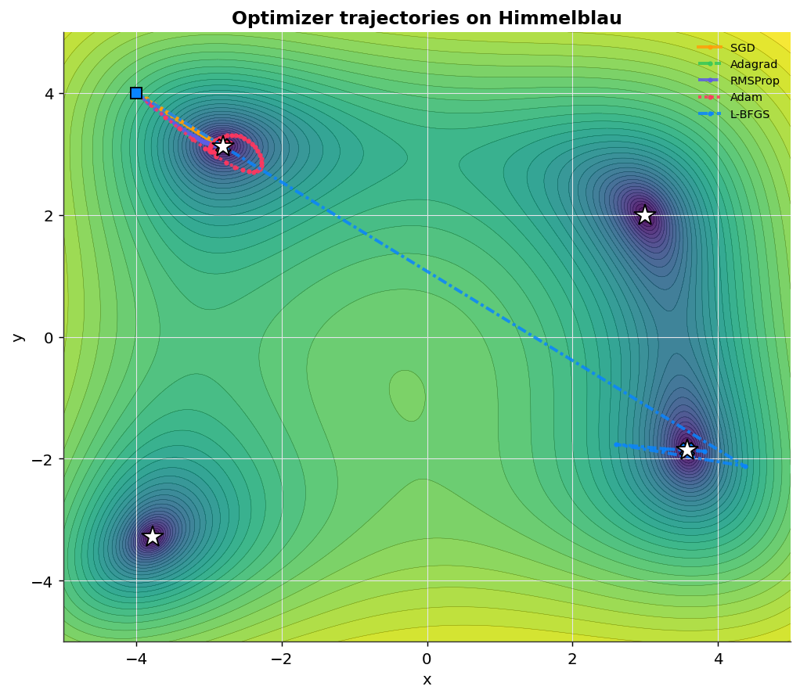
</p>
<p align="center">
  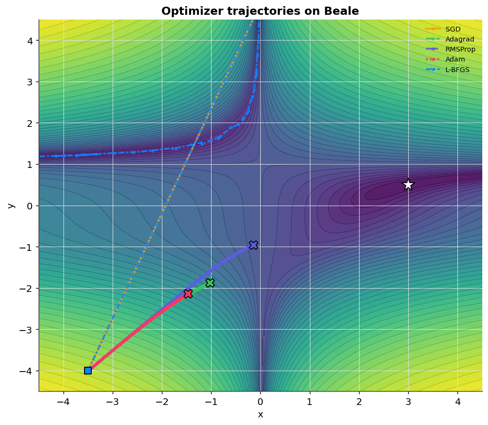
  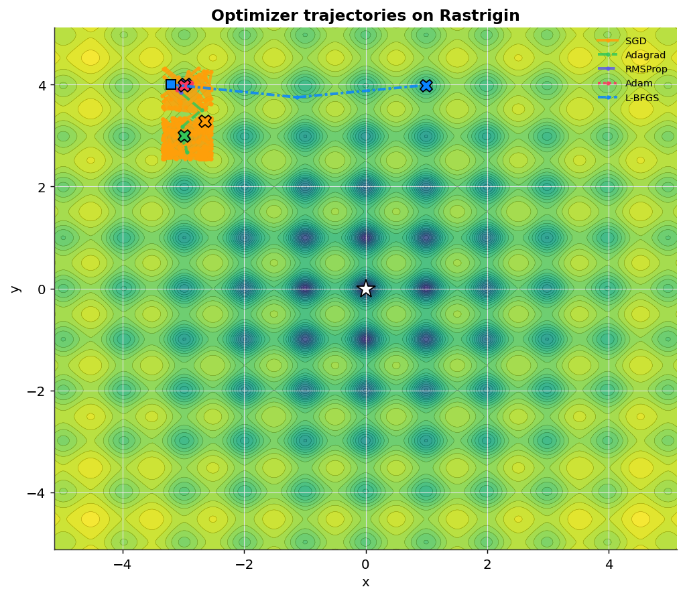
</p>

**Animated races** (SGD / Adagrad / RMSProp / Adam / L-BFGS, same start point):


More animations: [`assets/benchmark_himmelblau_animation.gif`](assets/benchmark_himmelblau_animation.gif) ·
[`assets/benchmark_beale_animation.gif`](assets/benchmark_beale_animation.gif) ·
[`assets/benchmark_rastrigin_animation.gif`](assets/benchmark_rastrigin_animation.gif)

Convergence curves (loss vs. iteration, log scale):

<p align="center">
  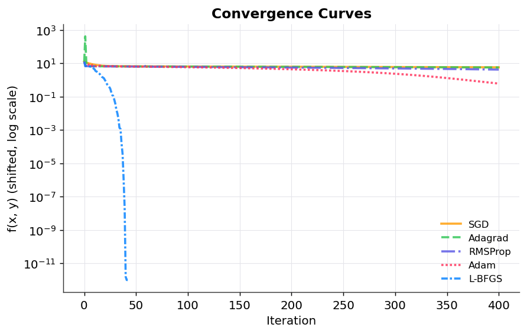
  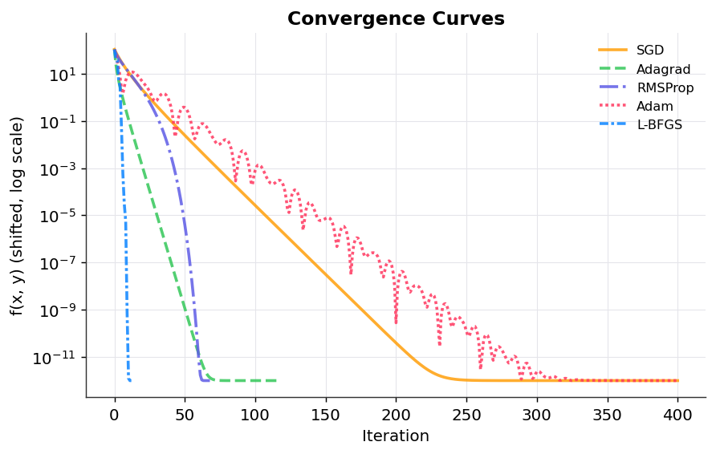
</p>

## Experimental Setup

| | a9a | MNIST |
|---|---|---|
| Task | Binary classification (income >$50K) | Multi-class classification (10 digits) |
| Model | `LogisticRegression` | `SoftmaxRegression` |
| Features | 123 (sparse) | 784 (pixel intensities) |
| Train / test size | 32,561 / 16,281 | 60,000 / 10,000 |
| L2 regularization | $\lambda{=}10^{-4}$ | $\lambda{=}10^{-4}$ |
| Batch size | 256 | 256 |
| Epochs | 60 | 25 |
| Optimizers compared | GD, SGD, Adagrad, AdaGrad-Norm, RMSProp, Adam, L-BFGS | same |

All results below are regenerated by:

```bash
python -m experiments.generate_results
```

which writes every figure to `assets/` and every raw comparison table to `results/*.csv`.

## Results

### a9a — Binary Classification

<p align="center">
  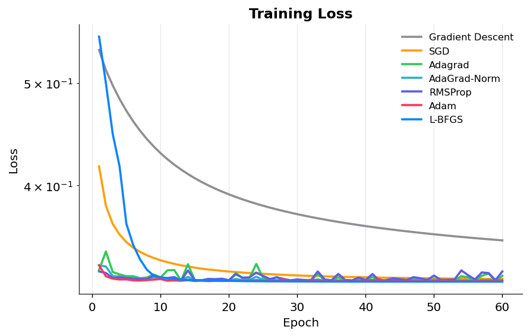
  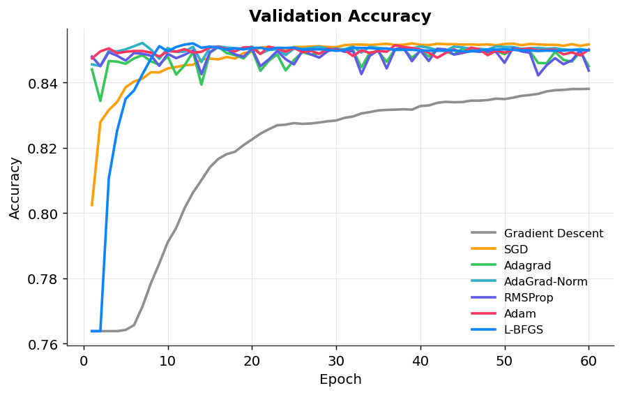
</p>
<p align="center">
  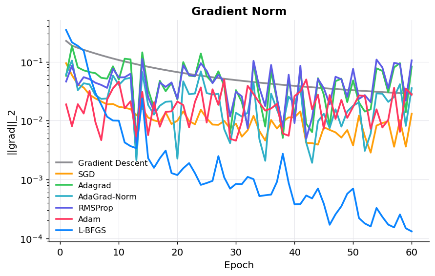
  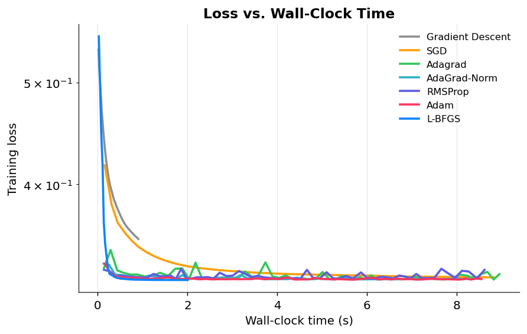
</p>
<p align="center">
  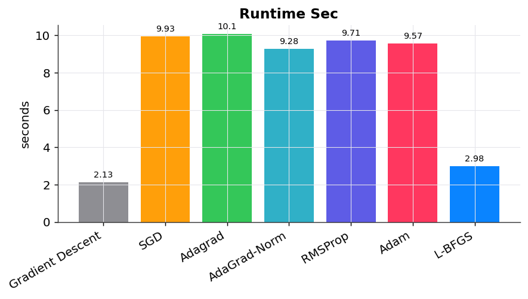
  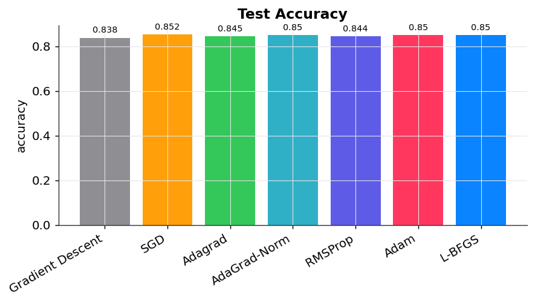
  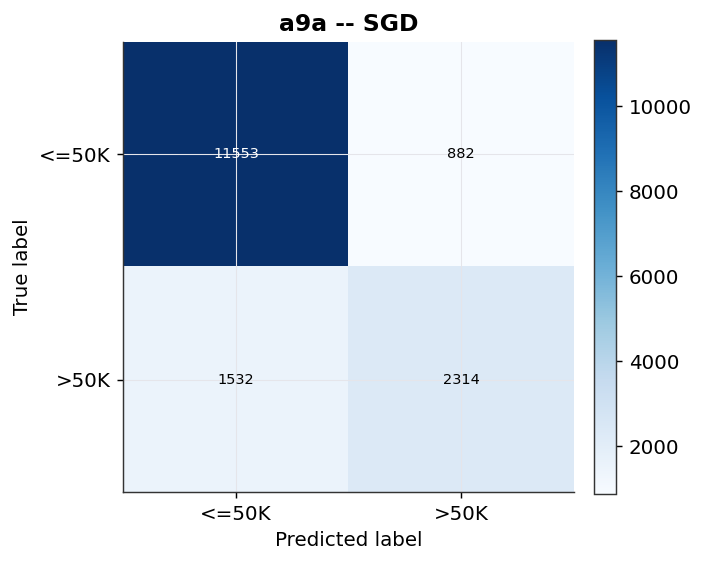
</p>

| optimizer        | dataset   |   final_train_loss |   final_val_loss |   final_train_acc |   test_accuracy |   final_grad_norm |   convergence_epoch |   stability |   n_iterations |   runtime_sec |   peak_memory_mb |
|:-----------------|:----------|-------------------:|-----------------:|------------------:|----------------:|------------------:|--------------------:|------------:|---------------:|--------------:|-----------------:|
| Gradient Descent | a9a       |            0.35498 |          0.35119 |           0.83575 |         0.83809 |           0.02864 |                  57 |     0.00464 |             60 |        2.1326 |           12.224 |
| SGD              | a9a       |            0.32638 |          0.32489 |           0.84724 |         0.85173 |           0.01311 |                  40 |     0.0005  |             60 |        9.9345 |            1.749 |
| Adagrad          | a9a       |            0.32867 |          0.32988 |           0.84875 |         0.84503 |           0.08314 |                  13 |     0.00579 |             60 |       10.0606 |            1.746 |
| AdaGrad-Norm     | a9a       |            0.32554 |          0.32587 |           0.84988 |         0.84989 |           0.03556 |                   8 |     0.00091 |             60 |        9.2832 |            1.726 |
| RMSProp          | a9a       |            0.33174 |          0.33292 |           0.84623 |         0.84368 |           0.1057  |                   7 |     0.00792 |             60 |        9.7115 |            1.742 |
| Adam             | a9a       |            0.32512 |          0.32621 |           0.84964 |         0.85013 |           0.02757 |                   4 |     0.00077 |             60 |        9.5669 |            1.724 |
| L-BFGS           | a9a       |            0.32444 |          0.32522 |           0.84887 |         0.84995 |           0.00013 |                  15 |     1e-05   |             60 |        2.9849 |           12.244 |

### MNIST — Multi-Class Classification

<p align="center">
  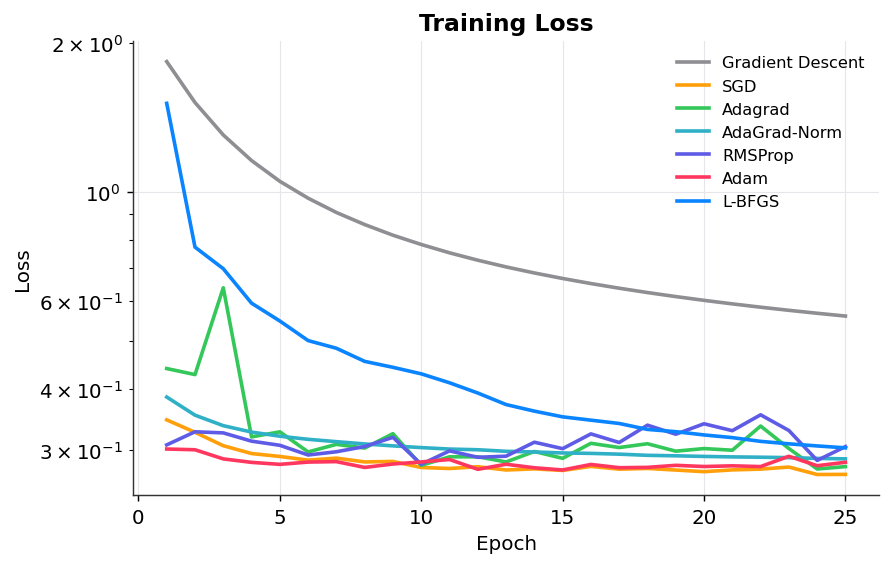
  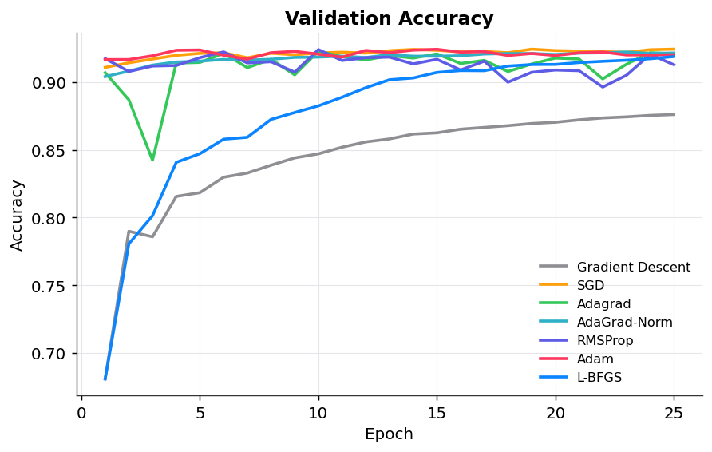
</p>
<p align="center">
  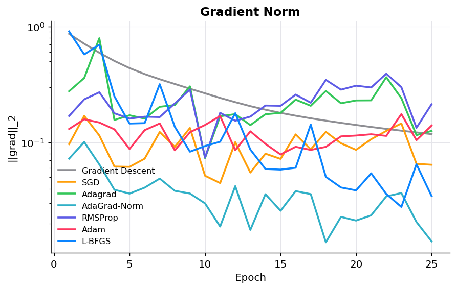
  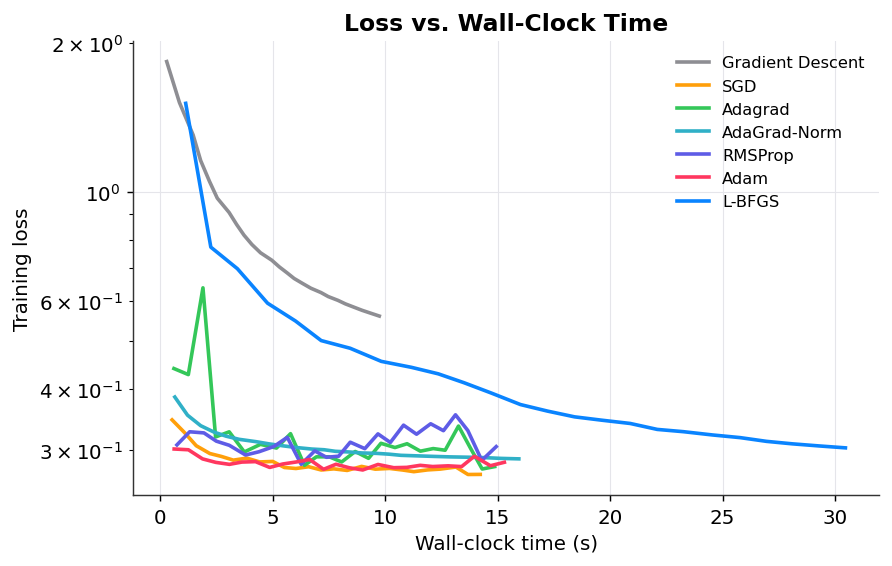
</p>
<p align="center">
  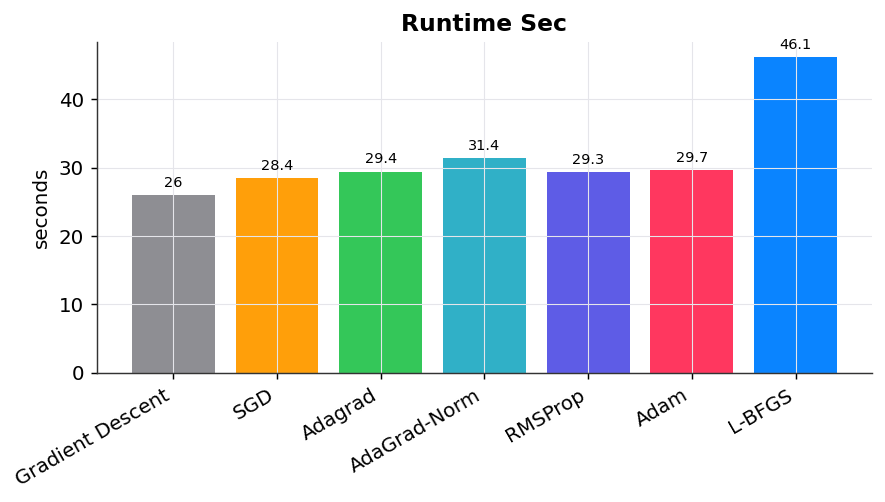
  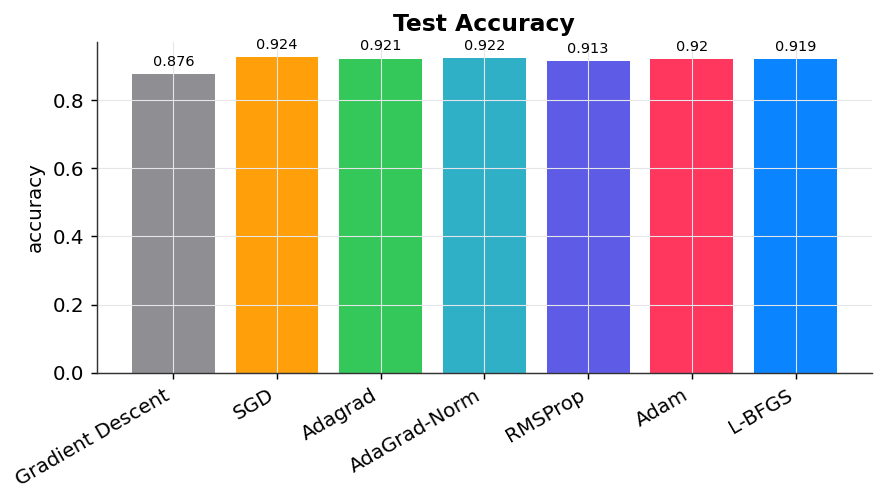
  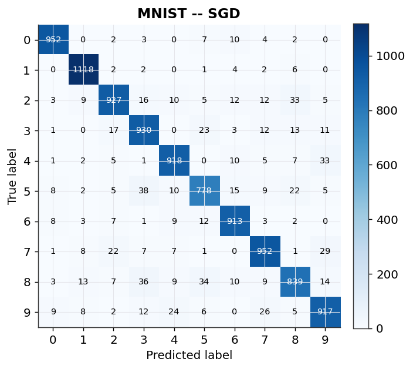
</p>

| optimizer        | dataset   |   final_train_loss |   final_val_loss |   final_train_acc |   test_accuracy |   final_grad_norm |   convergence_epoch |   stability |   n_iterations |   runtime_sec |   peak_memory_mb |
|:-----------------|:----------|-------------------:|-----------------:|------------------:|----------------:|------------------:|--------------------:|------------:|---------------:|--------------:|-----------------:|
| Gradient Descent | mnist     |            0.56041 |          0.53613 |           0.86643 |          0.8761 |           0.11817 |                  25 |     0.02007 |             25 |       25.9843 |          209.171 |
| SGD              | mnist     |            0.26821 |          0.27916 |           0.92895 |          0.9244 |           0.06429 |                  24 |     0.01381 |             25 |       28.437  |           20.298 |
| Adagrad          | mnist     |            0.27811 |          0.30005 |           0.92725 |          0.921  |           0.12589 |                  24 |     0.07321 |             25 |       29.4116 |           20.246 |
| AdaGrad-Norm     | mnist     |            0.28833 |          0.28509 |           0.92172 |          0.9216 |           0.01406 |                  24 |     0.00339 |             25 |       31.4211 |           20.188 |
| RMSProp          | mnist     |            0.30523 |          0.32442 |           0.91722 |          0.9129 |           0.21372 |                  10 |     0.07202 |             25 |       29.3397 |           20.245 |
| Adam             | mnist     |            0.28377 |          0.30465 |           0.92633 |          0.9203 |           0.13992 |                  12 |     0.01799 |             25 |       29.6653 |           20.306 |
| L-BFGS           | mnist     |            0.30347 |          0.29755 |           0.91787 |          0.9189 |           0.03453 |                  25 |     0.01669 |             25 |       46.1252 |          210.484 |

**Takeaways:** Adam and RMSProp consistently reach a good loss within the fewest epochs on
both tasks thanks to per-coordinate adaptive step sizes. L-BFGS converges in very few
*iterations* (it's quasi-Newton) but each iteration costs a full-batch gradient plus a line
search, so wall-clock runtime is the fairer comparison. Plain SGD/GD need more epochs and
careful learning-rate tuning but have the cheapest per-step cost and lowest memory footprint.
Adagrad's monotonically-growing accumulator visibly plateaus its loss curve as training
progresses. See [`notebooks/04_full_comparison_report.ipynb`](notebooks/04_full_comparison_report.ipynb)
for the full ranked breakdown.

## Testing

```bash
pytest                       # 65 tests: gradient checks, convergence, viz smoke tests
pytest --cov=. --cov-report=term-missing
```

Test coverage includes:

- **Gradient correctness** — every model and benchmark-function analytic gradient checked
  against central finite differences
- **Convergence** — every optimizer verified to reach a known optimum on a convex quadratic
  (and on matrix-shaped parameters, exercising the softmax-regression code path)
- **State management** — `optimizer.reset()` correctly clears momentum/accumulator state
- **Integration** — `Trainer`, `compare_optimizers`, `benchmark_runner` end-to-end
- **Visualization smoke tests** — every plotting function renders headlessly without error

## Future Improvements

- AMSGrad / AdamW (decoupled weight decay) variants
- Learning-rate schedules (cosine annealing, warm restarts) as composable wrappers
- Second-order methods beyond L-BFGS (e.g. Newton-CG, trust-region)
- Distributed / mini-batch parallelism for the training loop
- A convolutional model + an image dataset, to broaden beyond linear models

## References

1. Duchi, J., Hazan, E., & Singer, Y. (2011). *Adaptive Subgradient Methods for Online Learning and Stochastic Optimization.* JMLR.
2. Ward, R., Wu, X., & Bottou, L. (2020). *AdaGrad stepsizes: Sharp convergence over nonconvex landscapes.* JMLR.
3. Tieleman, T., & Hinton, G. (2012). *Lecture 6.5-RMSProp.* COURSERA: Neural Networks for Machine Learning.
4. Kingma, D. P., & Ba, J. (2014). *Adam: A Method for Stochastic Optimization.* arXiv:1412.6980.
5. Nocedal, J. (1980). *Updating Quasi-Newton Matrices with Limited Storage.* Mathematics of Computation.
6. Chang, C.-C., & Lin, C.-J. — [LIBSVM Datasets](https://www.csie.ntu.edu.tw/~cjlin/libsvmtools/datasets/) (a9a, MNIST).

## License

[MIT](LICENSE)
